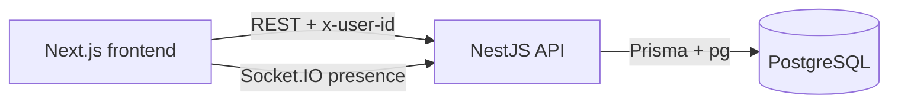
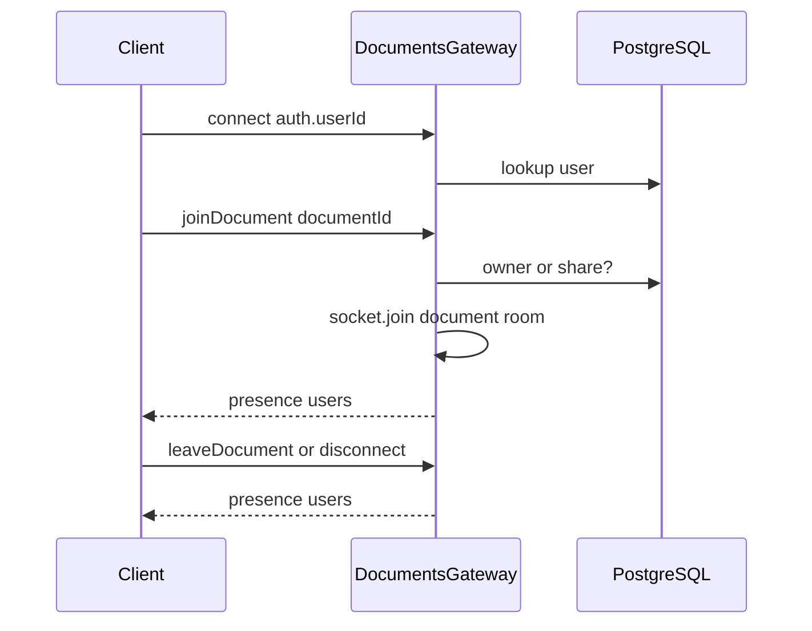
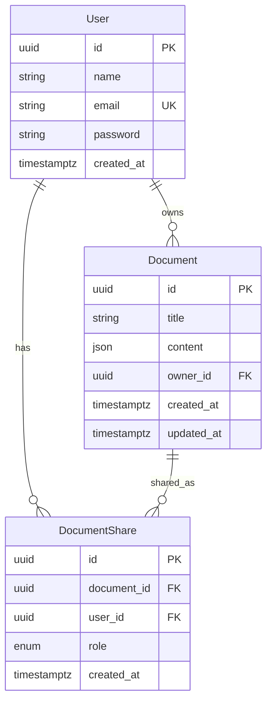

# Architecture

Ajaia is a document editor split into a Next.js frontend, a NestJS API, and PostgreSQL. Content is saved over REST with a 2s debounce. Socket.IO is used only for who is currently viewing a document, not for live editing.

| Layer | Stack |
| --- | --- |
| Frontend | Next.js 16, React 19, Tiptap, Tailwind CSS, socket.io-client |
| Backend | NestJS 11, Socket.IO, class-validator |
| Database | PostgreSQL (Prisma 7, `@prisma/adapter-pg`) |

The frontend talks to the API at `NEXT_PUBLIC_API_URL`. The API listens on `PORT` (default 3000) and uses `DATABASE_URL` at runtime. Prisma CLI uses `DIRECT_URL` when present so migrations can bypass a pooler.

---

## Frontend

The app lives in `frontend/` as a Next.js App Router project. Pages are thin; data fetching, auth, and editor logic sit in client components and `lib/`.

| Route | Purpose |
| --- | --- |
| `/` | Redirects to `/documents` or `/login` |
| `/login` | Email + password against `POST /auth/login` |
| `/documents` | Owned vs shared lists, create, import, rename, delete |
| `/documents/[id]` | Tiptap editor, share panel (owners), presence, refresh |

`AuthGate` wraps `/documents` and sends unauthenticated users to login. The current user is stored in `localStorage` (`ajaia.user`) and read through `useCurrentUser` so React does not re-parse JSON on every render.

`lib/api.ts` attaches `x-user-id` to REST calls. `lib/documents.ts` is the document/share/import client. `lib/presence.ts` opens a Socket.IO connection with `auth.userId`, joins the document room, and listens for `presence` snapshots.

The editor (`document-editor.tsx`) is Tiptap with StarterKit. Edits are debounced 2s and `PATCH`ed as JSON. A refresh button `GET`s the document and replaces editor content so REST stays the source of truth. Viewers get a read-only editor; only owners can rename.

---

## Backend

The API lives in `backend/` as a NestJS app: `PrismaModule` (global), `AuthModule`, and `DocumentsModule`. CORS allows any origin and the `x-user-id` header. DTOs are validated with a global `ValidationPipe` (`whitelist`, `transform`).

### Auth

Auth is lightweight, not JWT/OAuth.

- `POST /auth/login` (`@Public()`) looks up the user by email and compares the password in plain text.
- Every other HTTP route goes through a global `AuthGuard` that reads `x-user-id`, loads the user, and attaches it to the request.
- Socket connections skip that HTTP guard and authenticate in `DocumentsGateway` from handshake `auth.userId`.

### Documents REST

`DocumentsController` owns CRUD, import, and sharing. `DocumentAccessGuard` plus `@RequireAccess(...)` enforce role on each route.

| Method | Path | Minimum access |
| --- | --- | --- |
| `GET` | `/documents` | Authenticated (owned + shared lists) |
| `POST` | `/documents` | Authenticated |
| `POST` | `/documents/import` | Authenticated (creates a new owned doc) |
| `GET` | `/documents/:id` | Viewer |
| `PATCH` | `/documents/:id` | Editor (title is owner-only) |
| `POST` | `/documents/:id/import` | Editor (appends parsed content) |
| `DELETE` | `/documents/:id` | Owner |
| `GET/POST` | `/documents/:id/shares` | Owner |
| `PATCH/DELETE` | `/documents/:id/shares/:shareId` | Owner |

Roles: **owner** (full control), **editor** (content + import, not title or shares), **viewer** (read only). Sharing is by existing user email, `EDITOR` or `VIEWER`. An owner cannot share with themselves.

Import accepts `.txt`, `.md`, and `.docx` up to 5MB. Files stay in memory (Multer `memoryStorage`); they are parsed with mammoth / marked / Tiptap HTML and stored as Tiptap JSON. Nothing is written to disk.

### Presence

`DocumentsGateway` is Socket.IO with CORS `origin: true`. After connect, the client emits `joinDocument`. The gateway checks owner-or-share access, joins `document:{id}`, and emits a full `presence` snapshot `{ users: [{ id, name }] }` unique by user id (two tabs count as one person). `leaveDocument` and disconnect drop the socket from an in-memory map. Document content is never sent over the socket.

---

## Database

PostgreSQL is accessed through Prisma 7 with the `pg` driver adapter. Tables use snake_case (`@@map` / `@map`) and `timestamptz`. UUIDs are primary keys. Deleting a user or document cascades to related shares.

- **users** — seeded demo accounts; email is unique; password is stored in plain text for this assessment.
- **documents** — Tiptap JSON in `content`; indexed on `owner_id`.
- **document_shares** — unique `(document_id, user_id)`; role is `EDITOR` or `VIEWER` (default `VIEWER`); indexed on `user_id`.

`DATABASE_URL` is used by the running Nest process (including pooled URLs). Prisma migrate / db push use `DIRECT_URL` when set so they talk to Postgres directly.
